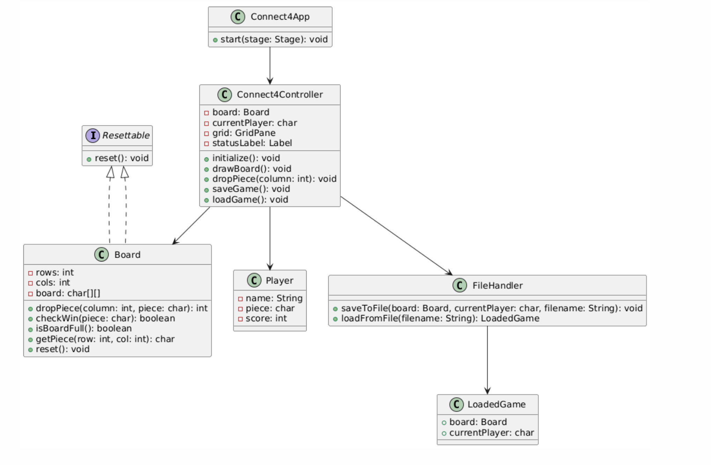

# 4 på rad – Dokumentasjon

### Kandidat: Sebastian Westin Ingebrigtsen

### Fag: TDT4100 – Objektorientert programmering

---

## 1. Beskrivelse av appen

Denne applikasjonen er et digitalt 4 på rad-spill utviklet med Java og JavaFX som del av prosjektet i TDT4100 – Objektorientert programmering. Spillet lar to spillere spille mot hverandre lokalt, der turene går på rundgang til en av spillerne får fire brikker på rad, eller brettet er fullt.

Appen består av flere klasser som følger Model-View-Controller-arkitektur: `Board` håndterer tilstanden og logikken i spillet, `Connect4Controller` binder sammen GUI og logikk, og `Connect4App` starter programmet. I tillegg brukes en `Player`-klasse og en `FileHandler`-klasse for å håndtere filbasert lagring og lasting av spill.

Brukeren spiller via et grafisk grensesnitt laget i JavaFX med FXML, hvor hver brikke vises som en farget sirkel i et rutenett. Appen inneholder funksjonalitet for å starte nytt spill, lagre og laste spill fra fil, og håndterer feil på en brukervennlig måte med statustekster og popup-vinduer.

Applikasjonen er testet med JUnit 5, med fokus på spilllogikk og filhåndtering. Den er bygget opp med innkapsling, grensesnitt og feilhåndtering i tråd med kravene i prosjektbeskrivelsen.

---

## 2. Diagram

Her er et klassediagram som viser struktur og sammenhenger mellom de viktigste klassene i applikasjonen:

---

## 3. Spørsmål

### 1. Hvilke deler av pensum i emnet dekkes i prosjektet, og på hvilken måte?

- **Innkapsling**: Alle felt i `Board` er private. Tilstand endres kun via metoder som `dropPiece()`.
- **Grensesnitt (interface)**: Klassen `Board` implementerer `Resettable`-interfacet.
- **Model-View-Controller (MVC)**: `Board` er modell, `Connect4Controller` er kontroller, og FXML definerer visning.
- **Feilhåndtering**: Appen bruker `try/catch` og `Alert`-vinduer for fil- og inputfeil.
- **Testing**: JUnit 5 brukes til å teste både logikk og filhåndtering.

### 2. Dersom deler av pensum ikke er dekket, hvordan kunne dere brukt dem?

- **Arv** kunne vært brukt ved å lage en abstrakt `Game`-klasse og arve `Connect4Game`, men det ble vurdert som overengineering for dette prosjektet.
- **Delegering** kunne vært brukt mer eksplisitt for f.eks. UI-oppdatering, men vi valgte å holde logikken samlet i kontrolleren for enkelhet.

### 3. Hvordan forholder koden deres seg til Model-View-Controller-prinsippet?

Applikasjonen er delt inn slik at:

- `Board` kun inneholder logikk og data, og har ingen kjennskap til GUI
- `Connect4Controller` håndterer all kommunikasjon mellom GUI og modell
- `App.fxml` definerer brukergrensesnittet (View)
  Selv om kontrolleren inneholder noe tilstand (`currentPlayer`), er den hovedsakelig ansvarlig for koordinering. Det følger MVC-prinsippet tydelig nok for et prosjekt på dette nivået.

### 4. Hvordan har dere gått frem når dere skulle teste appen, og hvorfor har dere valgt de testene dere har?

Vi har fokusert på å teste den viktigste funksjonaliteten i `Board` (spilllogikk) og `FileHandler` (filhåndtering). Det er skrevet seks enhetstester totalt:

- 5 for `Board`: f.eks. dropPiece, vinnertester og fullbrettsjekk
- 1 for `FileHandler`: tester at lagring og henting fungerer
  Controller og GUI er ikke testet, da de primært bruker JavaFX og ikke inneholder komplisert logikk. Dette følger beste praksis for å teste "modell"-delen i MVC.

---
